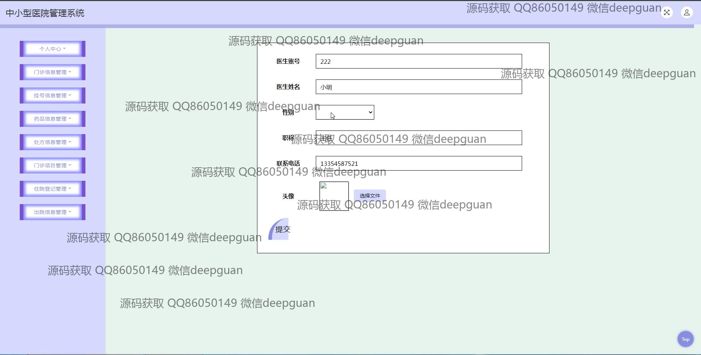
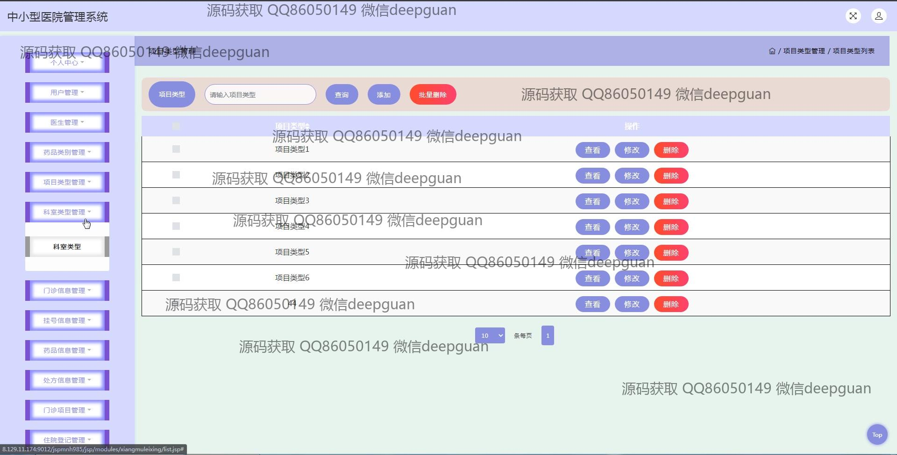
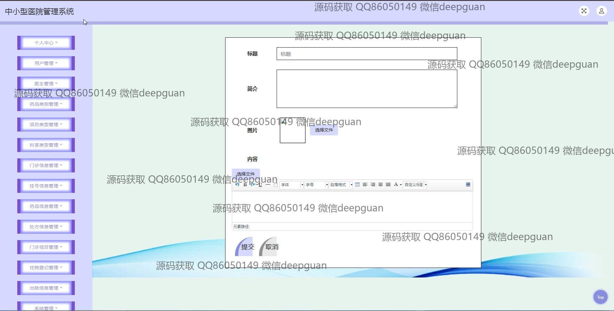
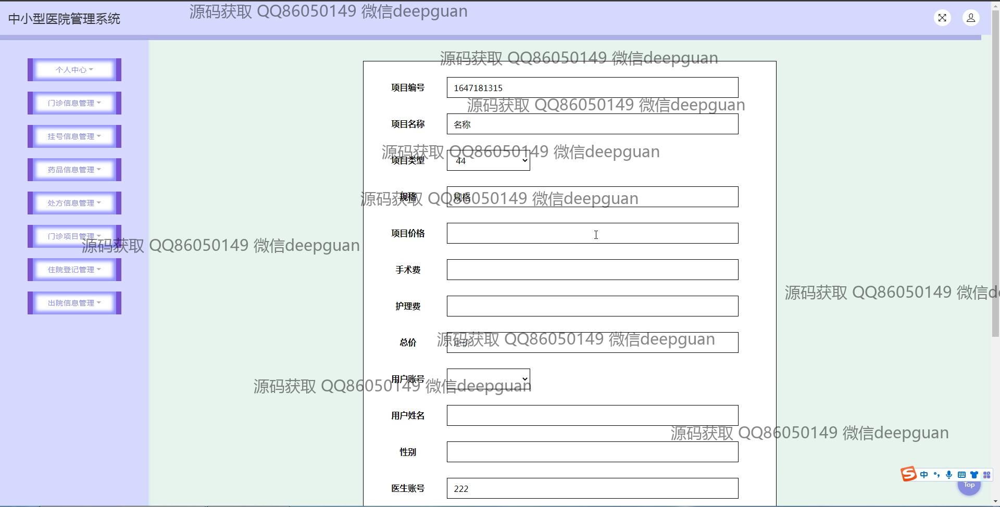
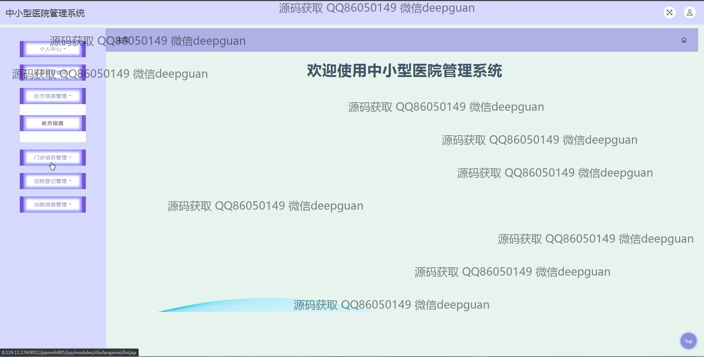

<h1 align="center">中小型医院管理系统的设计与实现+jsp</h1>

## 简介
中小型医院管理系统，角色分为管理员、用户、医生；功能包括用户管理、医生管理、门诊信息管理、处方信息管理、药品信息管理、挂号信息管理、住院登记管理和出院信息管理。    --计算机毕业设计源码；毕设源码；java毕业设计源码

## 联系方式

<h3 align="center">获取完整代码与数据库文件 + 微信：deepguan QQ: 86050149 QQ群: 783742310</h3>

<h3 align="center">可帮忙远程部署 包运行成功！提供远程部署、修改代码、设计文档指导、代码讲解等服务！</h3>

## 功能介绍（完整见运行截图）
管理员： 管理员负责用户管理、医生管理、挂号信息管理、药品信息管理、处方信息管理、门诊信息管理、住院登记管理和出院信息管理等。管理员可以修改系统设置，查看和编辑所有用户与医生的账户信息，审核医生和用户注册，并可执行添加、修改、删除的操作，确保数据的准确性和及时更新。此外，管理员还负责生成系统使用报告以便决策分析。

医生： 医生可以通过个人中心查看并管理自己的患者信息，录入和管理病人的门诊记录和处方信息。医生账户可以自主注册，并能够在系统中更新个人信息、查看预约挂号信息、开具处方、管理患者处方及住院信息。医生还可以上传诊疗相关文件，并管理科室以及项目相关的检查记录。

用户： 用户包括患者和医院员工，用户可以登录系统查看个人中心、预约挂号和查询门诊信息，查看药品信息和项目类别管理，用户可以注册新的账户、修改个人信息、查看医院科室及医生信息、更新个人联系人信息，并可以进行相关查询，如药品、处方、住院和出院信息查询等，方便获取医疗服务。

系统功能： 系统框架为中小型医院提供信息化医疗管理平台，主要功能模块包括用户和医生管理、门诊信息管理、挂号信息、处方和药品管理、住院登记和出院信息管理。通过这些功能，提升医院的管理效率和服务质量，支持信息录入、编辑、删除、查询操作，并提供包括搜索栏、分页功能、文件上传及详细信息查看等便捷的功能接口以利于用户使用。

## 运行截图

本代码来源于网络,仅供学习参考使用!

